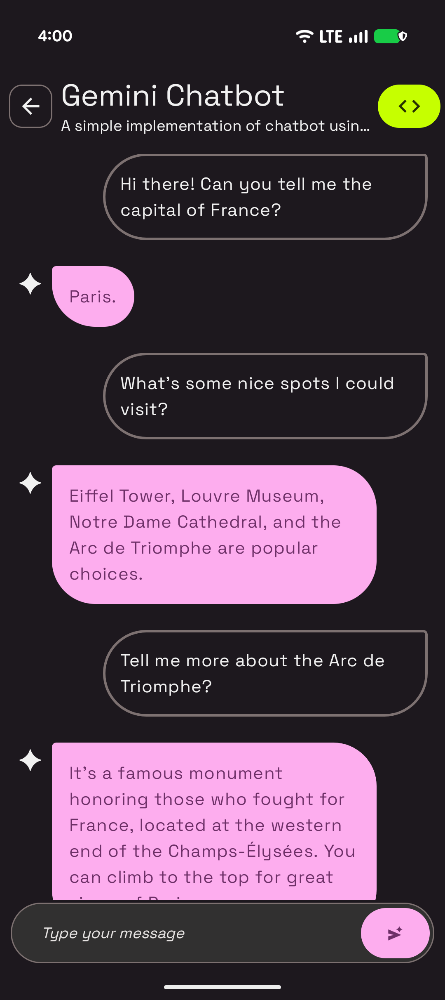

# Gemini Chatbot Sample

This sample is part of the [AI Sample Catalog](../../). To build and run this sample, you should clone the entire repository.

## Description

This sample demonstrates a basic chat bot using the Gemini Flash model. Users can send text-based messages, and the generative model will respond, creating an interactive chat experience. This showcases how to build a simple, yet powerful, conversational AI with the Gemini API.

<div style="text-align: center;">

</div>

## How it works

The application uses the Firebase AI SDK (see [How to run](../../#how-to-run)) for Android to interact with the Gemini Flash model. The core logic is in the `GeminiChatbotViewModel.kt` file. A `generativeModel` is initialized, and then a `chat` session is started from it. When a user sends a message, it's passed to the model, which then generates a text response.

Here is the key snippet of code that calls the generative model:

```kotlin
private val generativeModel by lazy {
    Firebase.ai(backend = GenerativeBackend.googleAI()).generativeModel("gemini-2.5-flash")
}
private val chat = generativeModel.startChat()

fun sendMessage(message: String) {
    viewModelScope.launch {
        // ...
        val response = chat.sendMessage(message)
        // ...
    }
}
```

Read more about the [Gemini API](https://developer.android.com/ai/gemini) in the Android Documentation.
