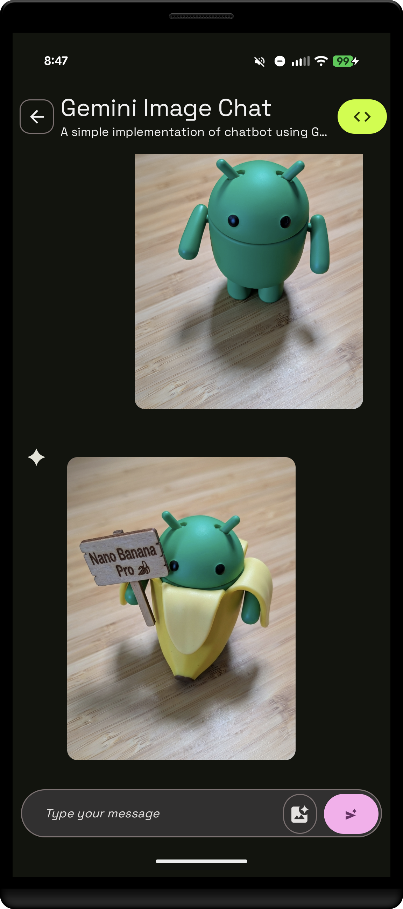

# Gemini Image Chat Sample

This sample is part of the [AI Sample Catalog](../../). To build and run this sample, you should clone the entire repository.

## Description

This sample demonstrates a chat bot using `Gemini 3 Pro Image` (a.k.a [Nano Banana Pro](https://deepmind.google/models/gemini-image/pro/)) that can understand both text and images and generate images and text in return. Users can send a message that includes an image, and the generative model will respond based on the multimodal input. This showcases how to build powerful, interactive image generation chat experiences with the Gemini API.

<div style="text-align: center;">

</div>

## How it works

The application uses the Firebase AI SDK (see [How to run](../../#how-to-run)) for Android to interact with the `Gemini 3 Pro Image` model. The core logic is in the `GeminiImageChatViewModel.kt` file. When a user sends a message with an image, a `content` block is created that includes both the text and the `Bitmap` of the image. This multimodal content is then sent to the model.

Here is how the model is instantiated:
```kotlin
 Firebase.ai(backend = GenerativeBackend.googleAI()).generativeModel(
            "gemini-3-pro-image-preview",
            generationConfig = generationConfig {
                temperature = 0.9f
                topK = 32
                topP = 1f
                maxOutputTokens = 4096
                responseModalities = listOf(ResponseModality.TEXT, ResponseModality.IMAGE)
            },
            safetySettings = listOf(
                SafetySetting(HarmCategory.HARASSMENT, HarmBlockThreshold.MEDIUM_AND_ABOVE),
                SafetySetting(HarmCategory.HATE_SPEECH, HarmBlockThreshold.MEDIUM_AND_ABOVE),
                SafetySetting(HarmCategory.SEXUALLY_EXPLICIT, HarmBlockThreshold.MEDIUM_AND_ABOVE),
                SafetySetting(HarmCategory.DANGEROUS_CONTENT, HarmBlockThreshold.MEDIUM_AND_ABOVE),
            ),
            systemInstruction = content {
                text("""You are a friendly assistant. Keep your responses short.""")
            },
        )
```

Here is the key snippet of code that calls the generative model:

```kotlin
val content = content {
    text(message)
    if (bitmap != null) {
        image(bitmap)
    }
}
val response = chat.sendMessage(content)
```

Read more about [image generation with Gemini](https://developer.android.com/ai/gemini/developer-api#generate-images) in the Android Documentation.
