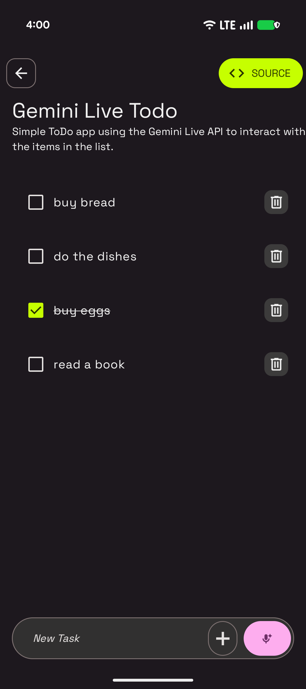

# Gemini Live Todo Sample

This sample is part of the [AI Sample Catalog](../../). To build and run this sample, you should clone the entire repository.

## Description

This sample demonstrates how to use the Gemini Live API for real-time, voice-based interactions in a simple to-do application. Users can add, remove, and update tasks by speaking to the app, showcasing a hands-free, conversational user experience powered by the Gemini API.

<div style="text-align: center;">

</div>

## How it works

The application uses the Firebase AI SDK (see [How to run](../../#how-to-run)) for Android to interact with Gemini Flash. The core logic is in the [`TodoScreenViewModel.kt`](./src/main/java/com/android/ai/samples/geminilivetodo/ui/TodoScreenViewModel.kt) file. A `liveModel` is initialized with a set of function declarations (`addTodo`, `removeTodo`, `toggleTodoStatus`, `getTodoList`) that allow the model to interact with the ToDo list. When the user starts a voice conversation, the model processes the spoken commands and executes the corresponding functions to manage the tasks.

Here is the key snippet of code that initializes the model and connects to a live session:

```kotlin
val generativeModel = Firebase.ai(backend = GenerativeBackend.vertexAI()).liveModel(
    "gemini-2.5-flash-native-audio-preview-12-2025",
    generationConfig = liveGenerationConfig,
    systemInstruction = systemInstruction,
    tools = listOf(
        Tool.functionDeclarations(
            listOf(getTodoList, addTodo, removeTodo, toggleTodoStatus),
        ),
    ),
)

try {
    session = generativeModel.connect()
} catch (e: Exception) {
    Log.e(TAG, "Error connecting to the model", e)
    liveSessionState.value = LiveSessionState.Error
}
```

Read more about the [Gemini Live API](https://developer.android.com/ai/gemini/live) in the Android Documentation.
