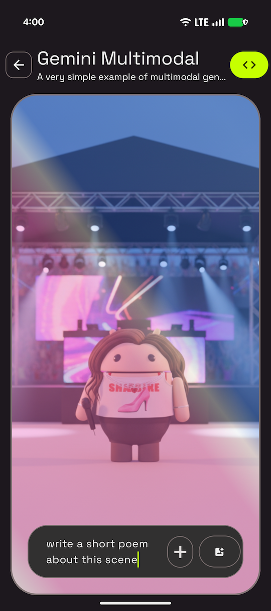

# Gemini Multimodal Sample

This sample is part of the [AI Sample Catalog](../../). To build and run this sample, you should clone the entire repository.

## Description

This sample demonstrates a multimodal (image and text) prompt, using the Gemini Flash model. Users can select an image and provide a text prompt, and the generative model will respond based on both inputs. This showcases how to build a simple, yet powerful, multimodal AI with the Gemini API.

<div style="text-align: center;">

</div>

## How it works

The application uses the Firebase AI SDK (see [How to run](../../#how-to-run)) for Android to interact with Gemini Flash. The core logic is in the [`GeminiDataSource.kt`](./src/main/java/com/android/ai/samples/geminimultimodal/data/GeminiDataSource.kt) file. A `generativeModel` is initialized, and then a `chat` session is started from it. When a user provides an image and a text prompt, they are combined into a multimodal prompt and sent to the model, which then generates a text response.

Here is the key snippet of code that initializes the generative model:

```kotlin
private val generativeModel by lazy {
    Firebase.ai(backend = GenerativeBackend.googleAI()).generativeModel(
        "gemini-2.5-flash",
        generationConfig = generationConfig {
            temperature = 0.9f
            topK = 32
            topP = 1f
            maxOutputTokens = 4096
        },
        safetySettings = listOf(
            SafetySetting(HarmCategory.HARASSMENT, HarmBlockThreshold.MEDIUM_AND_ABOVE),
            SafetySetting(HarmCategory.HATE_SPEECH, HarmBlockThreshold.MEDIUM_AND_ABOVE),
            SafetySetting(HarmCategory.SEXUALLY_EXPLICIT, HarmBlockThreshold.MEDIUM_AND_ABOVE),
            SafetySetting(HarmCategory.DANGEROUS_CONTENT, HarmBlockThreshold.MEDIUM_AND_ABOVE),
        ),
    )
}
```

Here is the key snippet of code that calls the [`generateText`](./src/main/java/com/android/ai/samples/geminimultimodal/data/GeminiDataSource.kt) function:

```kotlin
suspend fun generateText(bitmap: Bitmap, prompt: String): String {
    val multimodalPrompt = content {
        image(bitmap)
        text(prompt)
    }
    val result = generativeModel.generateContent(multimodalPrompt)
    return result.text ?: ""
}
```

Read more about [the Gemini API](https://developer.android.com/ai/gemini) in the Android Documentation.

