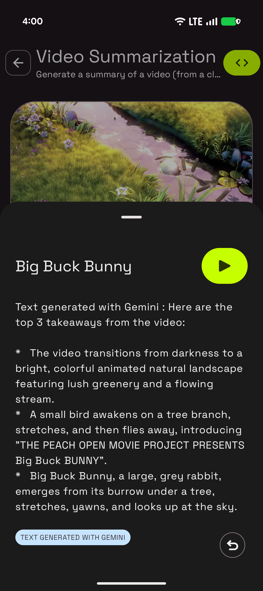

# Gemini Video Summarization Sample

This sample is part of the [AI Sample Catalog](../../). To build and run this sample, you should clone the entire repository.

## Description

This sample demonstrates how to generate a text summary of a video using Gemini Flash. Users can select a video, and the generative model will analyze its content to provide a concise summary, showcasing how to extract key information from video content with the Gemini API.

<div style="text-align: center;">

</div>

## How it works

The application uses the Firebase AI SDK (see [How to run](../../#how-to-run)) for Android to interact with Gemini Flash. The core logic is in the [`VideoSummarizationViewModel.kt`](./src/main/java/com/android/ai/samples/geminivideosummary/viewmodel/VideoSummarizationViewModel.kt) file. A `generativeModel` is initialized. When a user requests a summary, the video content and a text prompt are sent to the model, which then generates a text summary.

Here is the key snippet of code that calls the generative model:

```kotlin
val generativeModel =
    Firebase.ai(backend = GenerativeBackend.vertexAI())
        .generativeModel("gemini-2.5-flash")

val requestContent = content {
    fileData(videoSource.toString(), "video/mp4")
    text(promptData)
}
val outputStringBuilder = StringBuilder()
generativeModel.generateContentStream(requestContent).collect { response ->
    outputStringBuilder.append(response.text)
}
```

Read more about [getting started with Gemini](https://developer.android.com/ai/gemini) in the Android Documentation.
