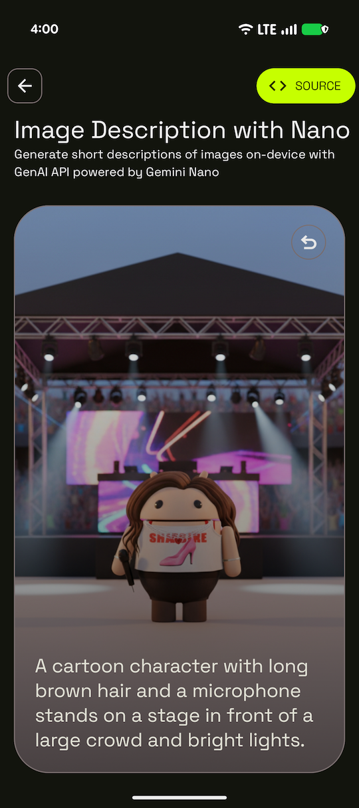

# Image Description with On-Device Gemini Nano Sample

This sample is part of the [AI Sample Catalog](../../). To build and run this sample, you should clone the entire repository.

## Description

This sample demonstrates how to generate short descriptions of images on-device using the ML Kit GenAI API powered by Gemini Nano. Users can select an image, and the model will generate a short descriptive text, showcasing the power of on-device multimodal AI.

<div style="text-align: center;">

</div>

## How it works

The application uses the ML Kit GenAI Image Description API to interact with the on-device Gemini Nano model. The core logic is in the [`GenAIImageDescriptionViewModel.kt`](https://github.com/android/ai-samples/blob/main/samples/genai-image-description/src/main/java/com/android/ai/samples/genai_image_description/GenAIImageDescriptionViewModel.kt) file. An `ImageDescriber` client is initialized. When a user provides an image, it's converted to a bitmap and sent to the `runInference` method, which streams back the generated description.

Here is the key snippet of code that calls the generative model:

```kotlin
private var imageDescriber: ImageDescriber = ImageDescription.getClient(
    ImageDescriberOptions.builder(context).build(),
)
//...

private suspend fun generateImageDescription(imageUri: Uri) {
    _uiState.value = GenAIImageDescriptionUiState.Generating("")
    val bitmap = MediaStore.Images.Media.getBitmap(context.contentResolver, imageUri)
    val request = ImageDescriptionRequest.builder(bitmap).build()

    imageDescriber.runInference(request) { newText ->
        _uiState.update {
            (it as? GenAIImageDescriptionUiState.Generating)?.copy(partialOutput = it.partialOutput + newText) ?: it
        }
    }.await()
    // ...
}
```

Read more about [GenAI Image Description API](https://developers.google.com/ml-kit/genai/image-description/android) in the documentation.
