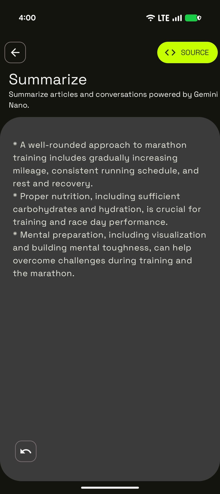

# Summarization with On-Device Gemini Nano Sample

This sample is part of the [AI Sample Catalog](../../). To build and run this sample, you should clone the entire repository.

## Description

This sample demonstrates how to summarize articles and conversations on-device using the GenAI API powered by Gemini Nano. Users can input text, and the model will generate a summary in 1-3 bullet points, showcasing the power of on-device text processing with AI.

<div style="text-align: center;">

</div>

## How it works

The application uses the ML Kit GenAI Summarization API to interact with the on-device Gemini Nano model. The core logic is in the `GenAISummarizationViewModel.kt` file. A `Summarizer` client is initialized. When a user provides text, it's passed to the `runInference` method, which streams back the generated summary.

Here is the key snippet of code that calls the generative model from [`GenAISummarizationViewModel.kt`](./src/main/java/com/android/ai/samples/genai_summarization/GenAISummarizationViewModel.kt):

```kotlin
private suspend fun generateSummarization(summarizer: Summarizer, textToSummarize: String) {
    _uiState.value = GenAISummarizationUiState.Generating("")
    val summarizationRequest = SummarizationRequest.builder(textToSummarize).build()

    try {
        // Instead of using await() here, alternatively you can attach a FutureCallback<SummarizationResult>
        summarizer.runInference(summarizationRequest) { newText ->
            (_uiState.value as? GenAISummarizationUiState.Generating)?.let { generatingState ->
                _uiState.value = generatingState.copy(generatedOutput = generatingState.generatedOutput + newText)
            }
        }.await()
    } catch (genAiException: GenAiException) {
        // ...
    }
    // ...
}
```

Read more about [GenAI Summarization API](https://developers.google.com/ml-kit/genai/summarization/android) in the documentation.
