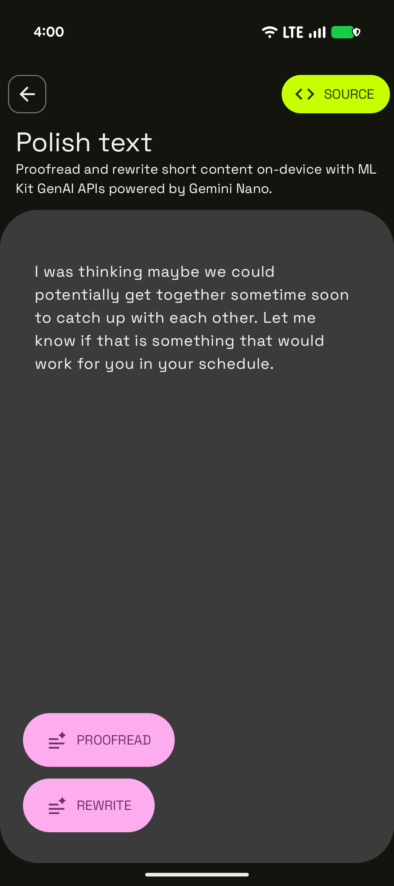

# Writing Assistance with On-Device Gemini Nano Sample

This sample is part of the [AI Sample Catalog](../../). To build and run this sample, you should clone the entire repository.

## Description

This sample demonstrates how to proofread and rewrite short content on-device using the ML Kit GenAI APIs powered by Gemini Nano. Users can input text and choose to either proofread it for grammar and spelling errors or rewrite it in various styles, showcasing on-device text manipulation with AI.

<div style="text-align: center;">

</div>

## How it works

The application uses the ML Kit GenAI Proofreading and Rewriting APIs to interact with the on-device Gemini Nano model. The core logic is in the [`GenAIWritingAssistanceViewModel.kt`](https://github.com/android/ai-samples/blob/main/samples/genai-writing-assistance/src/main/java/com/android/ai/samples/genai_writing_assistance/GenAIWritingAssistanceViewModel.kt) file. `Proofreader` and `Rewriter` clients are initialized. When a user provides text, it's passed to either the `runProofreadingInference` or `runRewritingInference` method, which then returns the polished text.

Here is the key snippet of code that runs the proofreading inference from [`GenAIWritingAssistanceViewModel.kt`](.src/main/java/com/android/ai/samples/genai_writing_assistance/GenAIWritingAssistanceViewModel.kt):

```kotlin
private suspend fun runProofreadingInference(textToProofread: String) {
    val proofreadRequest = ProofreadingRequest.builder(textToProofread).build()
    // More than 1 result may be generated. Results are returned in descending order of
    // quality of confidence. Here we use the first result which has the highest quality
    // of confidence.
    _uiState.value = GenAIWritingAssistanceUiState.Generating
    val results = proofreader.runInference(proofreadRequest).await()
    _uiState.value = GenAIWritingAssistanceUiState.Success(results.results[0].text)
}
```

Read more about the [GenAI Proofreading](https://developers.google.com/ml-kit/genai/proofreading/android) and [GenAI Rewriting](https://developers.google.com/ml-kit/genai/rewriting/android) documentation.
