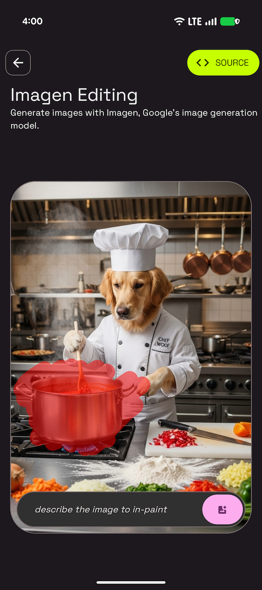

# Imagen Image Editing Sample

This sample is part of the [AI Sample Catalog](../../). To build and run this sample, you should clone the entire repository.

## Description

This sample demonstrates how to edit images using the Imagen editing model. Users can generate an image, then draw a mask on it and provide a text prompt to inpaint (fill in) the masked area, showcasing advanced image manipulation capabilities with Imagen.

<div style="text-align: center;">

</div>

## How it works

The application uses the Firebase AI SDK (see [How to run](../../#how-to-run)) for Android to interact with Imagen. The core logic is in the [`ImagenEditingDataSource.kt`](https://github.com/android/ai-samples/blob/main/samples/imagen-editing/src/main/java/com/android/ai/samples/imagenediting/data/ImagenEditingDataSource.kt) file. It first generates a base image using the generation model. Then, for editing, it takes the source image, a user-drawn mask, and a text prompt, and sends them to the editing model's `editImage` method to perform inpainting.

Here is the key snippet of code that performs inpainting from [`ImagenEditingDataSource.kt`](./src/main/java/com/android/ai/samples/imagenediting/data/ImagenEditingDataSource.kt):

```kotlin
@OptIn(PublicPreviewAPI::class)
suspend fun inpaintImageWithMask(sourceImage: Bitmap, maskImage: Bitmap, prompt: String, editSteps: Int = DEFAULT_EDIT_STEPS): Bitmap {
    val imageResponse = editingModel.editImage(
        referenceImages = listOf(
            ImagenRawImage(sourceImage.toImagenInlineImage()),
            ImagenRawMask(maskImage.toImagenInlineImage()),
        ),
        prompt = prompt,
        config = ImagenEditingConfig(
            editMode = ImagenEditMode.INPAINT_INSERTION,
            editSteps = editSteps,
        ),
    )
    return imageResponse.images.first().asBitmap()
}
```

Read more about [Imagen](https://developer.android.com/ai/imagen) in the Android Documentation.
