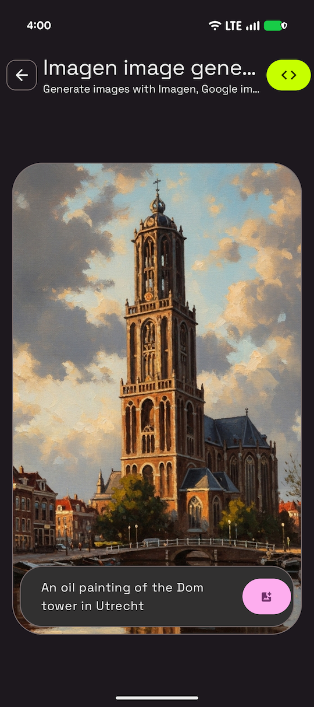

# Imagen Image Generation Sample

This sample is part of the [AI Sample Catalog](../../). To build and run this sample, you should clone the entire repository.

## Description

This sample demonstrates how to generate images from text prompts using the Imagen model. Users can input a text description, and the generative model will create an image based on that prompt, showcasing the power of text-to-image generation with Imagen.

<div style="text-align: center;">

</div>

## How it works

The application uses the Firebase AI SDK (see [How to run](../../#how-to-run)) for Android to interact with Imagen. The core logic is in the [`ImagenDataSource.kt`](./src/main/java/com/android/ai/samples/imagen/data/ImagenDataSource.kt) file. An `imagenModel` is initialized with specific generation configurations (e.g., number of images, aspect ratio, image format). When a user provides a text prompt, it's passed to the `generateImages` method, which returns the generated image as a bitmap.

Here is the key snippet of code that calls the generative model from [`ImagenDataSource.kt`](./src/main/java/com/android/ai/samples/imagen/data/ImagenDataSource.kt):

```kotlin
@OptIn(PublicPreviewAPI::class)
suspend fun generateImage(prompt: String): Bitmap {
    val imageResponse = imagenModel.generateImages(
        prompt = prompt,
    )
    val image = imageResponse.images.first()
    return image.asBitmap()
}
```

Read more about [Imagen](https://developer.android.com/ai/imagen) in the Android Documentation.
