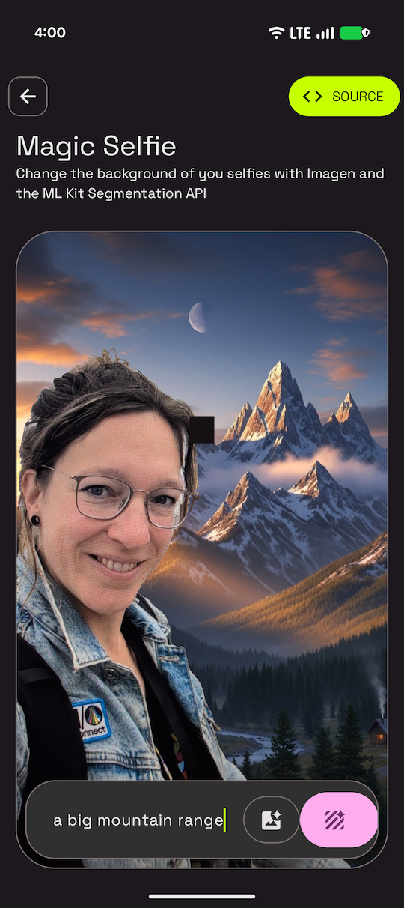

# Magic Selfie Sample

This sample is part of the [AI Sample Catalog](../../). To build and run this sample, you should clone the entire repository.

## Description

This sample demonstrates how to create a "magic selfie" by replacing the background of a user's photo with a generated image. It uses the ML Kit Subject Segmentation API to isolate the user from their original background and the Imagen API to generate a new background from a text prompt.

<div style="text-align: center;">

</div>

## How it works

The application uses two main components. First, the ML Kit Subject Segmentation API processes the user's selfie to create a bitmap containing only the foreground (the person). Second, the Firebase AI SDK (see [How to run](../../#how-to-run)) for Android interacts with the Imagen model to generate a new background image from a user-provided text prompt. Finally, the application combines the foreground bitmap with the newly generated background to create the final magic selfie. The core logic for this process is in the [`MagicSelfieViewModel.kt`](./src/main/java/com/android/ai/samples/magicselfie/ui/MagicSelfieViewModel.kt) and [`MagicSelfieRepository.kt`](./src/main/java/com/android/ai/samples/magicselfie/data/MagicSelfieRepository.kt) files.

Here is the key snippet of code that orchestrates the magic selfie creation from [`MagicSelfieViewModel.kt`](./src/main/java/com/android/ai/samples/magicselfie/ui/MagicSelfieViewModel.kt):

```kotlin
fun createMagicSelfie(bitmap: Bitmap, prompt: String) {
    viewModelScope.launch {
        try {
            _uiState.value = MagicSelfieUiState.RemovingBackground
            val foregroundBitmap = magicSelfieRepository.generateForegroundBitmap(bitmap)
            _uiState.value = MagicSelfieUiState.GeneratingBackground
            val backgroundBitmap = magicSelfieRepository.generateBackground(prompt)
            val resultBitmap = magicSelfieRepository.combineBitmaps(foregroundBitmap, backgroundBitmap)
            _uiState.value = MagicSelfieUiState.Success(resultBitmap)
        } catch (e: Exception) {
            _uiState.value = MagicSelfieUiState.Error(e.message)
        }
    }
}
```

Read more about the [Gemini API](https://developer.android.com/ai/gemini) in the Android Documentation.
